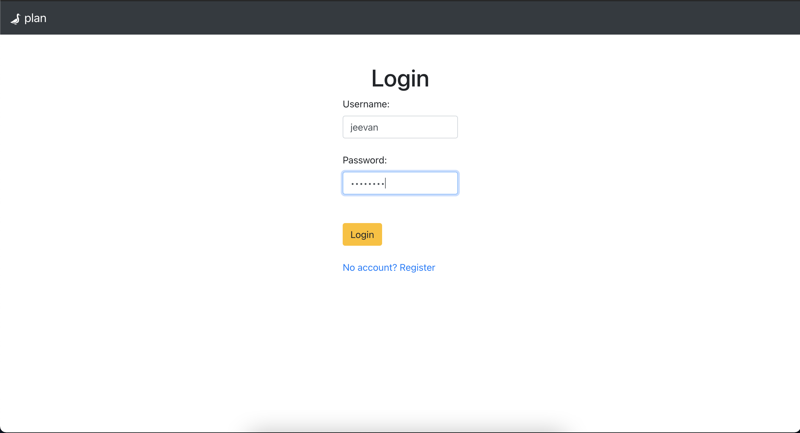
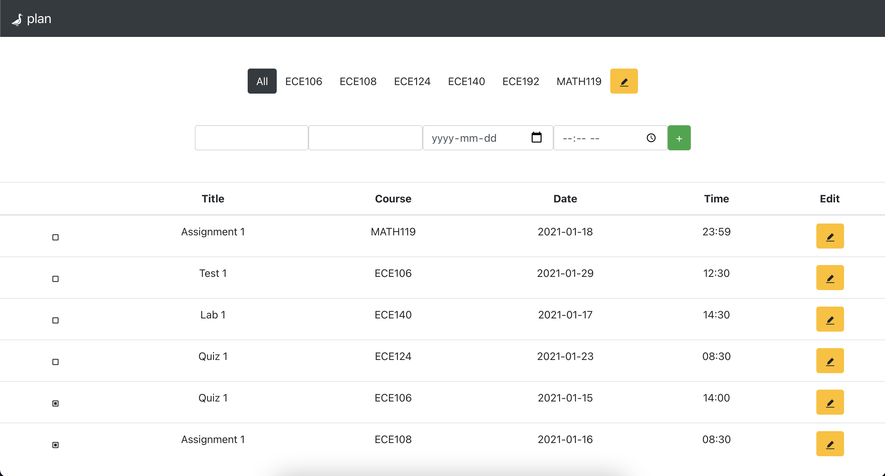

# goose-plan
Goose Plan is a personal agenda web application designed to help university students like myself manage their heavy workloads. Keeping track of deadlines is key for staying on track. Goose Plan was designed to make updating agenda items quick and easy, so that it wouldn't be a hastle having to frequently add and remove upcoming assignment and quiz deadlines. 

The core functionality of the project is complete, however it is still ongoing. Goose Plan is planned to be deployed at some point in the future for personal use and will be open for anyone to use.
### Features
- PostgreSQL database which stores usernames, encrypted passwords, agenda items, and courses for users
- RESTful API built with Node.js and Express which has routes to handle CRUD operation requests on the PostgreSQL database
- JWT-Authentication with the help of Passport.js
- Responsive, simple, and user-friendly Frontend designed with React and Bootstrap
### Demo
Login screen

Main user interface

